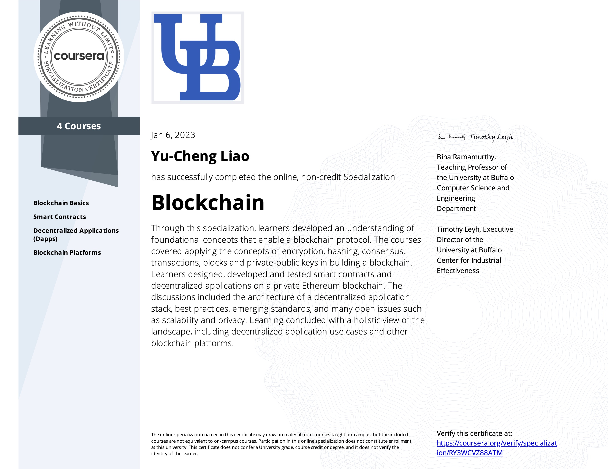

# Blockchain Specialization
Lecturer: [Bina Ramamurthy](https://www.coursera.org/instructor/~5767003)

# 1. Introduction

This repository are learning records of a professional course of blockchain offered by University at Buffalo and The State University of New York. The [Blockchain Specialization](https://www.coursera.org/specializations/blockchain#about) could be learned on Cousera. If you would like to understand blockchain, learn development, and join Web3, it's highly recommended! 

# 2. Courses and Assignment

The speclization comprises of 4 courses:

| Courses                                                      | Note                                                         |
| ------------------------------------------------------------ | ------------------------------------------------------------ |
| <a href="https://github.com/RamonLiao/Blockchain_Specialization-UBSUNY/tree/main/Course%201-Blockchain%20Basics">Course 1-Blockchain Basics</a> | Understand the history of Blockchain and fundamental logics of blockchain |
| <a href="https://github.com/RamonLiao/Blockchain_Specialization-UBSUNY/tree/main/Course%202-Smart%20Contracts">Course 2-Smart Contracts</a> | Understand how to develop smart contracts in Solidity and how to deploy |
| <a href="https://github.com/RamonLiao/Blockchain_Specialization-UBSUNY/tree/main/Course%203-Decentralized%20Applications%20(Dapps)">Course 3-Decntralized Applications (Dapps)</a> | Introduce the standards and concepts of develop decentralized apps |
| <a href="https://github.com/RamonLiao/Blockchain_Specialization-UBSUNY/tree/main/Course%204-Blockchain%20Platforms">Course 4-Blockchain Platforms</a> | Understand platforms and tools for developing blockchain  Also introduce th future development of blockchain. |

| Appendix                                                     | Note                                                         |
| ------------------------------------------------------------ | ------------------------------------------------------------ |
| <a href="https://github.com/RamonLiao/Blockchain_Specialization-UBSUNY/tree/main/CourseraDocs">Course Materials</a> | These materials are codes in Solidity and testing scripts in JavaScripts. |

/Certificate_Decentralised%20Applications%20(Dapps).jpg "Smart Contracts")

  

# Disclaimer

The assignment and solutions are only for reference purposes to support new learners who may get stuck in assignments. Learning is a long-term journey. Never give up and you will make it!!  
